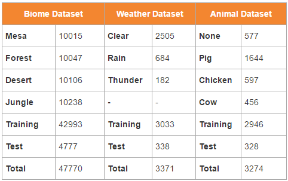
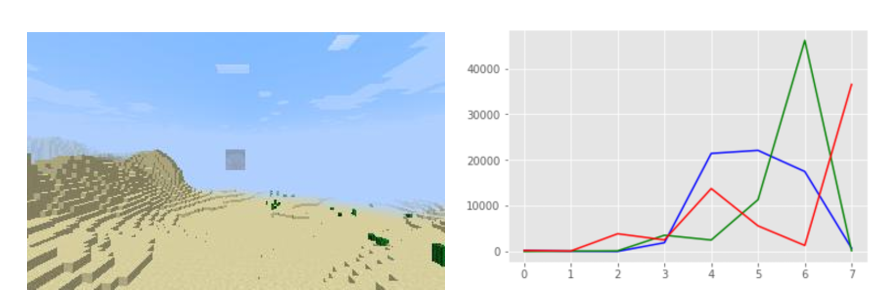
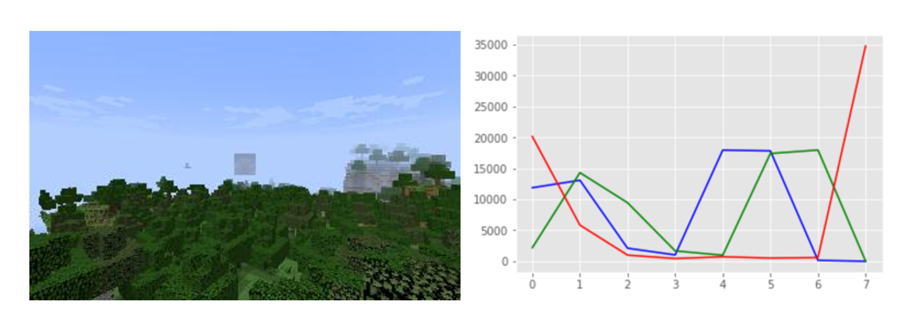
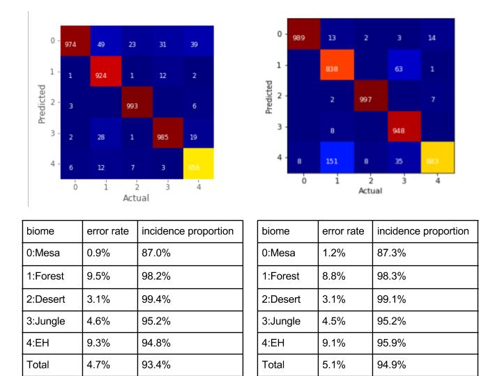
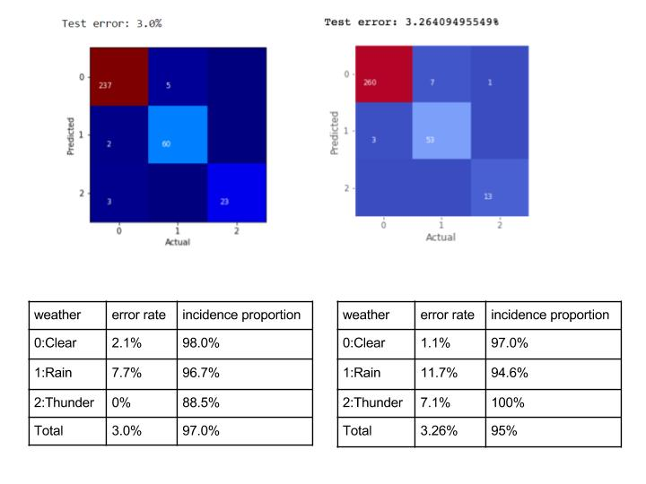
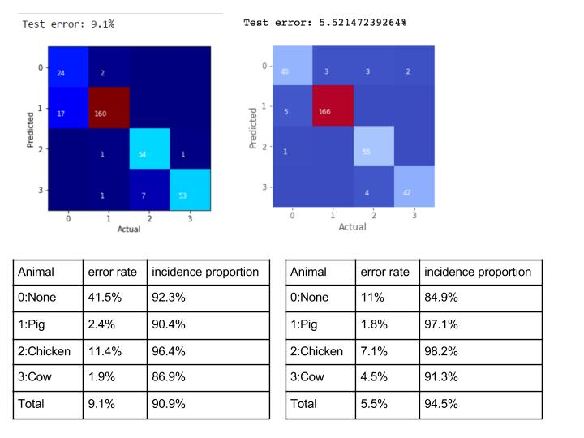
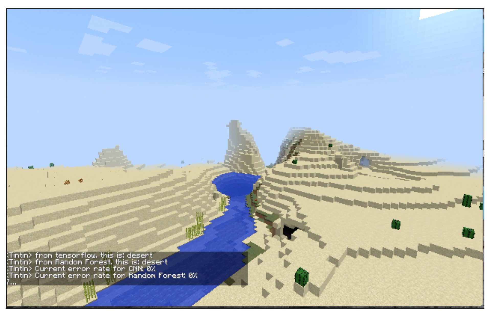
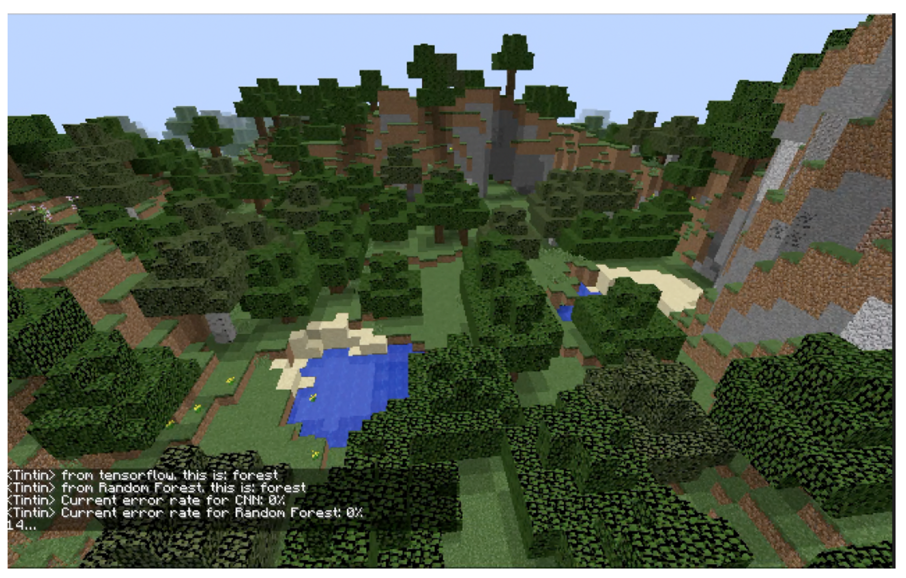

 

<iframe width="854" height="480" src="https://www.youtube.com/embed/a8_lpTQD7Dw" frameborder="0" allowfullscreen></iframe>

## Project Summary

The goal of our project is to create an agent “Tintin” that can recognize the environment of the Minecraft world, including the biome, animal, and weather, based on the images he perceives. In Minecraft, the distribution of the resources, such as the ore, depend on the biome type. Surely, an experienced player of Minecraft can easily recognize the biome of a certain area, but not for beginners. Therefore, it would be helpful to have an machine assistent that can tell the biome type. Similarly, knowing the animal type and the weather in the current environment can assist users to avoid dangers and survive. 

To achieve this goal, we do image recognition and apply two different kinds of methods:  Random Forest Multi-class Classifier and Convolutional Neural Network (CNN) with Tensorflow. The former has a good performance on the biome recognition, but the latter is comparatively better on the animal and weather recognitions. This difference is due to the way we deal with data and how models are trained. 

## Approaches

Data collection is an important part in our project. The more data, the the more accurate the result is. We have three different datasets: Biomes, Animals, and Weathers. 
For both the biome and weather data collection, we have an agent that walk randomly in the Minecraft world, pitching its head up and down, and save an image with size 320x200x3 (Width x height x channels) for every 3 seconds. Worlds we generated are all single biome worlds with different start time and different weathers. In conclusion, we have worlds with the combination of the following types: 

- 5 Biome types: Mesa, Forest, Desert, Jungle, and Extreme Hills (EH);
- 3 Weather types: Clear (normal), Rain, and Thunder (with snow);
- 4 Start Times: Morning, Noon, Dusk, and Dawn.

That is, we collect data from 60 different Minecraft worlds. After collection, we manually checked the pictures and deleted bad pictures (e.g. the agent may stuck inside the mountains in biomes such as mesa and eh and taking very dark pictures). The biome dataset size is illustrated in the first two columns of the table, and the weather dataset size is illustrated in third and fourth columns of the table below.

For the Animal dataset, we have 4 different types: None, Pig, Chicken and Cow. Compared to biomes, animals are small targets in images, and we cannot simply label images based on the world type we generated. Therefore, it is difficult to make sure the photos that our original automatic random walking agent took containing animals. First, we generate a flat world and put animals inside fences. Later, we also generate animals in biomes with specific x, y, z coordinates. For each mission, there is only one type of animal (or none) in the world. In each mission, we manually control the agent walk around the animals and take photos for every 3 seconds. The Animal dataset size is described in the last two columns of the table.

### Data Preprocessing

After we collect the data, we deal with the images in two different ways, one for the Convolutional Neural Network (CNN), and the other for the traditional Machine Learning (ML) methods, such as the Random Forest Multi-class Classifier. Given the large size of our image data, we found it impractical to load all images to the memory at one time for training and testing.

For the CNN, since we want to keep the original images and use a small batch of data to train the model. We convert our dataset to two tfrecord files (training/testing). We also use a FIFO queue with 3 threads to read the tfrecord and get a random batch every time we call it. 

In contrast to what we do for CNN, we convert an 320x200x3 image to data with 24 features for the traditional ML methods. Because of the difference in colors, human can recognize if an image is showing a mesa biome or a forest biome at a glance. That gives us an inspiration: is it possible to classify a biome simply based on the colors on an image? For each image in the dataset, we extract features using OpenCV module. An image is represented as an np array with shape (320,200,3) in Python.There are three channels, R,G,B, for an image, and in each channel there are 320x200 cells. Value in each cell varies between 0 and 255, inclusive. We get a histogram with 8 bins for each channel, that is, we divide range 0-255 into 8 small ranges. For each bin (e.g. range 0-32), we count the number of cells that have a value in that range. The histogram shown on the right represents the result for the mesa image at the left below. 

For traditional Machine Learning (ML) methods, we load data into txt file and then use Scikit-Learn Random Forest Multi-class Classifier model. After we get 8 bin values for each channel, and 24 bin values in total as an 8x3 array above, we flatten it to be an 1-d array and write it as a row to a txt file with a corresponding label. Since the size of data is significantly reduced, we can now load all the training data and test data for training using Scikit-Learn.

### Traditional Machine Learning

As we mentioned earlier in the data preprocessing section, the biomes may be distinguished purely based on the colors. Thus,  we decide to try Traditional Machine learning methods to see if they have better performance in weather and biome predictions. Specifically, since the colors (RGB) of desert and mesa are very distinguishable, the dataset for this biome is pretty structured. For instance, in Figure 5 (Desert), 6 (Forest), 7 (Mesa), the construction of each Figure is very different and distinguishable. Consequently, we want to try constructing Support Vector Machine (SVM) and Random Forest. 

Since we have three classes, R, G and B, We have tried MultiOutputClassifier with SVM and random forest. SVM is defined by a convex optimisation problem (no local minima) for which there are efficient methods and helps avoid over-fitting. However, SVM was very inefficient to train especially with large dataset. So we prefer to use random forest. Random forest, since it is nothing more than a bunch of Decision Trees combined, can handle categorical (binary) features very well. The other main advantage is that, because of how it is constructed (used bagging) these algorithms handle very well high dimensional spaces as well as large number of training examples. 

We train our model based on the preprocessed data with 24 features about RGB information for a single image. The Random Forest Multi-class Classifier we use have 100 estimators and a random state of 1, n_jobs=3, and others parameters we use the default settings in Scikit-Learn. For the input dataset, we split it into training data and test data with a ratio of 9:1. 

 ### Convolutional Neural Network

Some traditional machine learning methods, such as Support Vector Machine (SVM), have bad performance when the dataset has a lot of features. For an image, we can view each pixel as a feature, so an image with size 320x200x3 will have 192,000 features, which is unmanageable by the SVM. By the way, we make those methods workable for our large size data is to extract RGB histograms from each images as features. However, it does not maintain the basic structure of an image and loses too much information (e.g. shape) of it. On the contrary, Convolutional Neural Networks take advantage of the fact that the the input consists of images and they constrain the architecture in a more sensible way. For example, the CONV layer in CNN extract image features with convolution operation.

We implement a CNN model based on the instructions from [https://www.tensorflow.org/get_started/mnist/mechanics](https://www.tensorflow.org/get_started/mnist/mechanics) and [https://www.tensorflow.org/get_started/mnist/beginners](https://www.tensorflow.org/get_started/mnist/beginners).

Instead of reading data from zip files, we read data from tfrecord files. We separate the training data and the test data with a ratio of 9:1. Note that for all the data we feed into the CNN, the values in each image is rescaled from [0, 255] down to [-0.5, 0.5] and the data type is casted to float32. This is necessary because we should feed the data into the training/prediction nodes(represented as tf variables) and such nodes only accept data in some some specific types. We construct our CNN model with of 2 conv2d, 2 relu, 2 max pooling, 1 hidden, and 1 dropout layers. The figure below presents the basic model structure.

We also have the same models for weather and animal recognition. 

## Evaluation

Our evaluation plan has two parts. One is the quantity evaluation and the other is the quality evaluation. In the quantity evaluation, we separate our dataset into training dataset and test dataset and then we use the former one for training. After training, we use our model to make predictions on the test data, and evaluate the result. In the quality evaluation part, we combine our models with Malmo in Minecraft. We manually control our agent Tintin to walk in a Minecraft world with the same settings we have for the worlds where we collected data, and test the actual error rate based on the images the agent perceived in the Malmo mission.

### Quantitative Result

For the quantity evaluation, we use separated training data and test data to train the model and to assess the correctness. we have calculated the error rate and the incidence proportion for both CNN and random forest model with following two equations. 

$$ \textrm{Error rate of }i = \frac{\textrm{number of (Predicted label } i \textrm{ AND Actual label i)}}{\textrm{number of Actual label i}}  $$

$$ \textrm{Incidence proportion of }i = \frac{\textrm{number of (Predicted label } i \textrm{ AND Actual label } i)}{\textrm{number of Predicted label } i} $$

Note that we get the test data from the dataset randomly, and the test data for the CNN and Random Forest is different. The result may be affected. 

For the biome recognition, we can see that CNN has a slightly better performance. The error rate for CNN is 4.7% and that for Random Forest is 5.1%. 

Based on the training result, we can find that both CNN and Random Forest have good performance on weather recognition. Figure on the left below shows that the test error rate for CNN on weather dataset is 3.0%. Figure on the right shows that the test error rate for the Random Forest is 3.26%.

For the animal recognition, it seems like the Random Forest even has a better performance than the CNN. However, in the actual testing in Minecraft, CNN has a better performance on animal recognition. This is because our input for CNN keeps the basic shape of an image, which means that the input contains more information that would be crucial for the recognition. 

### Qualitative Result

To evaluate the quality of our project, we combine our two models: CNN and Random Forest with malmo.  Our player controls agent "TinTin" to walk in the Minecraft world and "Tintin" can give a prediction of the biome continuously. We can see whether Tintin is making the correct prediciton during the mission. Besides, we also calculate the cumulative error rate as the mission goes on to get a better judgement on the quality of our models. 

In the figure below you can see the prediction of CNN and Random Forest at this moment in a world with only dessert biome.  The current accumulated error is 0% for both. 

In this figure, you can see the prediction of CNN and Random Forest at this moment is both forest and the current accumulated error is 0% for both.

In this figure, you can see the prediction of Random Forest(sk) at this moment is both mesa and weather is raining, current accumulated error is 0% for both classifications.

In this figure, you can see the prediction of CNN at this moment is both eh and the weather is thunder (snow), current accumulated error is 33.3% for weather classification and 6.7% for biome classification. 

### Reference
- [Stanford CS 231n](http://cs231n.github.io/convolutional-networks/#conv)
- [https://www.tensorflow.org/get_started/mnist/mechanics](https://www.tensorflow.org/get_started/mnist/mechanics)
- [https://www.tensorflow.org/get_started/mnist/beginners](https://www.tensorflow.org/get_started/mnist/beginners)
- [https://github.com/scikit-learn/scikit-learn](https://github.com/scikit-learn/scikit-learn)
- [http://scikit-learn.org/stable/modules/generated/sklearn.ensemble.RandomForestClassifier.html](http://scikit-learn.org/stable/modules/generated/sklearn.ensemble.RandomForestClassifier.html)
- [http://scikit-learn.org/stable/modules/multiclass.html](http://scikit-learn.org/stable/modules/multiclass.html)
- [http://scikit-learn.org/stable/modules/svm.html](http://scikit-learn.org/stable/modules/svm.html)

