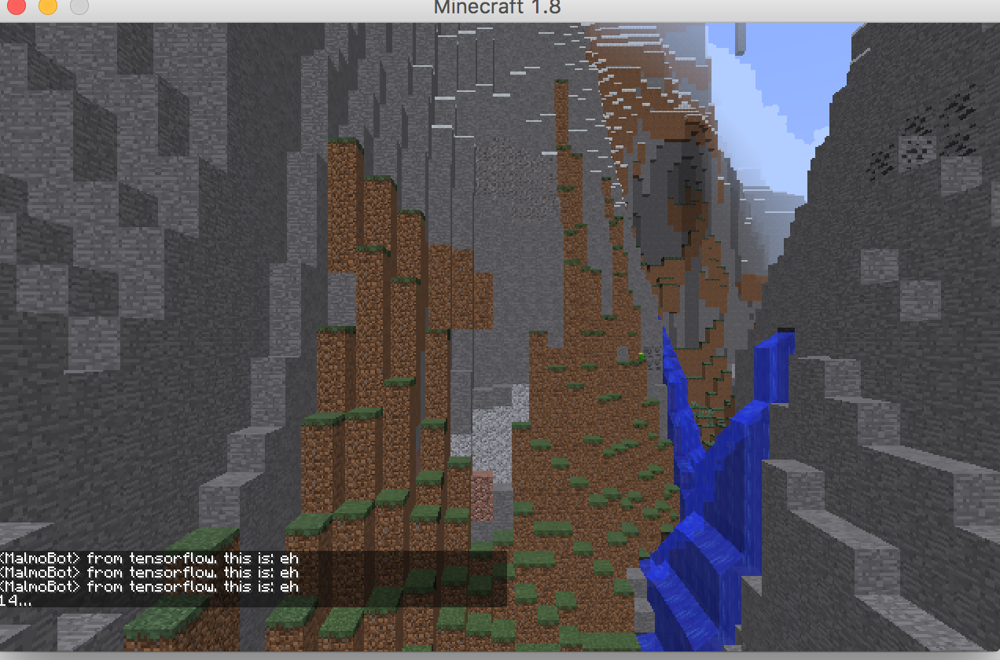

Our AI recognizes biomes, entities and weathers (we are still working on those ...). When you start playing Minecraft, it supplies you knowledge about the current enviroment:

"Hi, you are in a forest and its raining now"

"Here's a pig in front of you."

"You are in the desert with clear weather"

Isn't that cool to have tour guide to walk you through Minecraft?

Here's a screenshot, but you should explore more by playing with the project!

