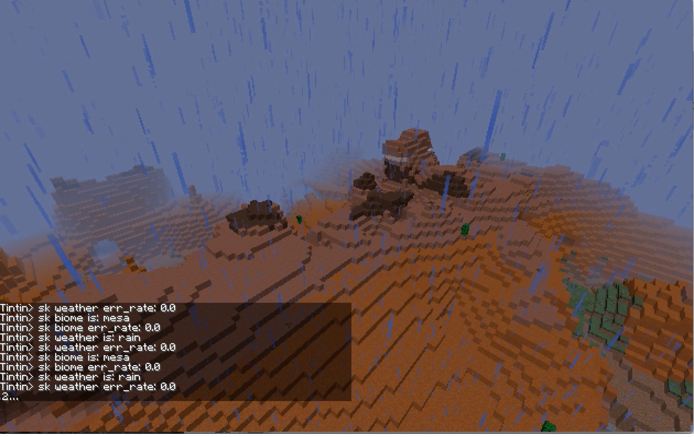
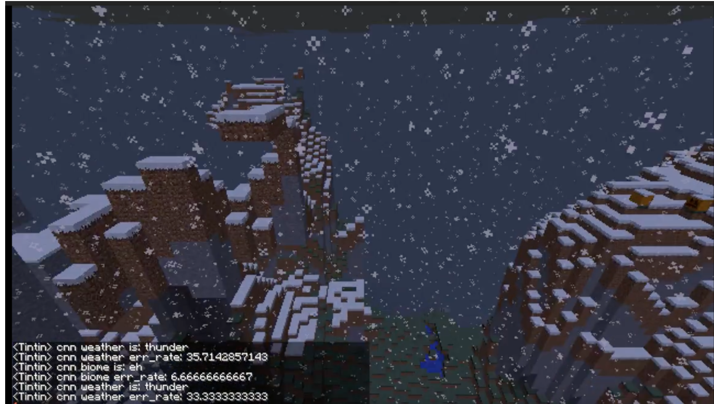

Welcome to our CS175 Project in AI repository. Our Minecraft Malmo agent "Tintin"(the character on the left) can give predictions on the biome, current weather and the pig occurance continuously based on the images he perceives. For example, our AI supplies you knowledge about the current enviroment:

"Hi, you are in a forest."

"Find a place to hide, it is raining now"

"Here's a pig in front of you."

"You are in the desert. Weather is clear now. Enjoy the sunshine."

Isn't that cool to have a tour guide to walk you through Minecraft?

Here's a screenshot, but you would explore more magic by playing with the project!

