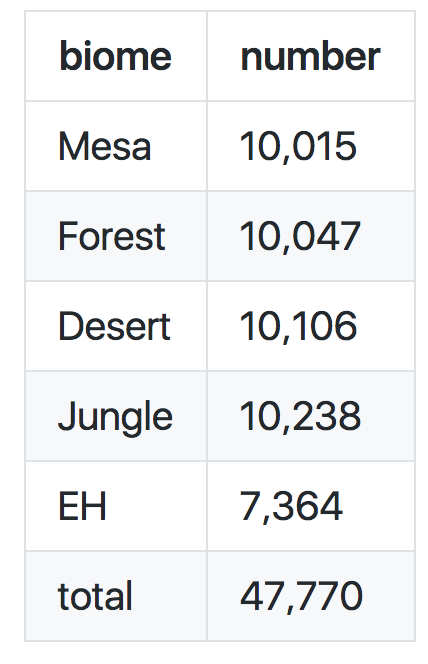
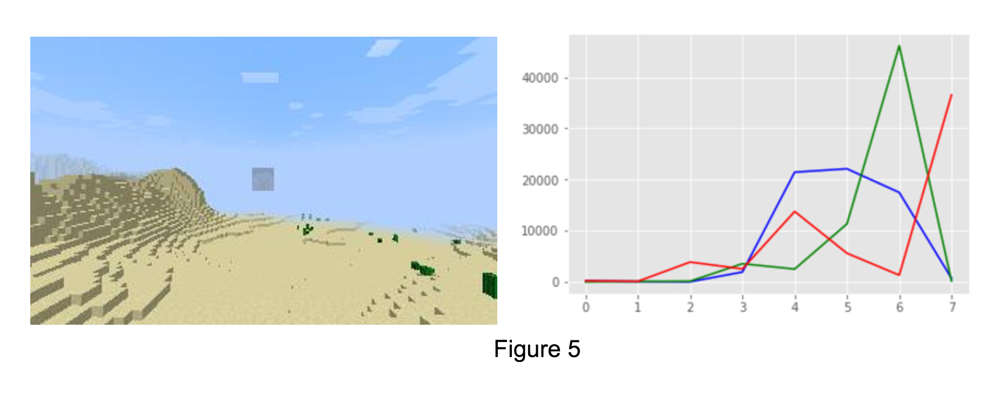
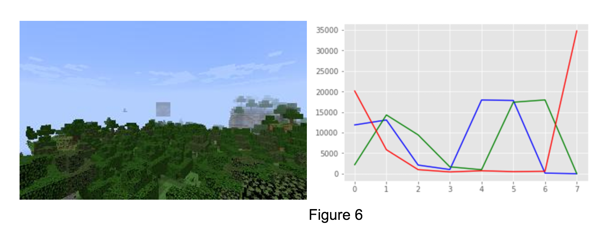
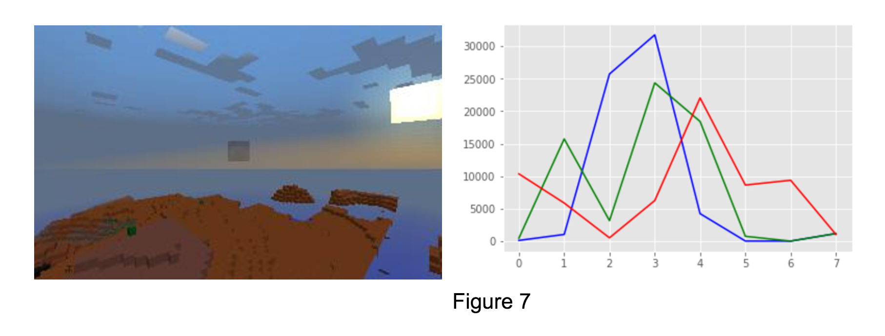
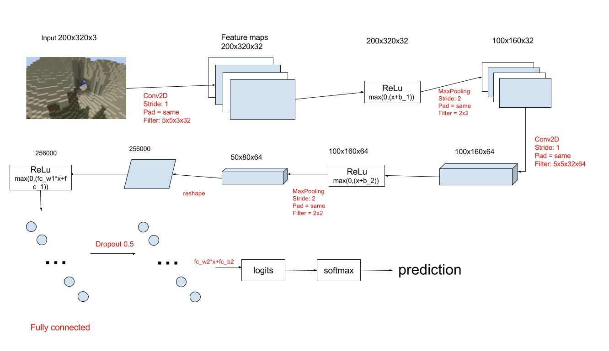
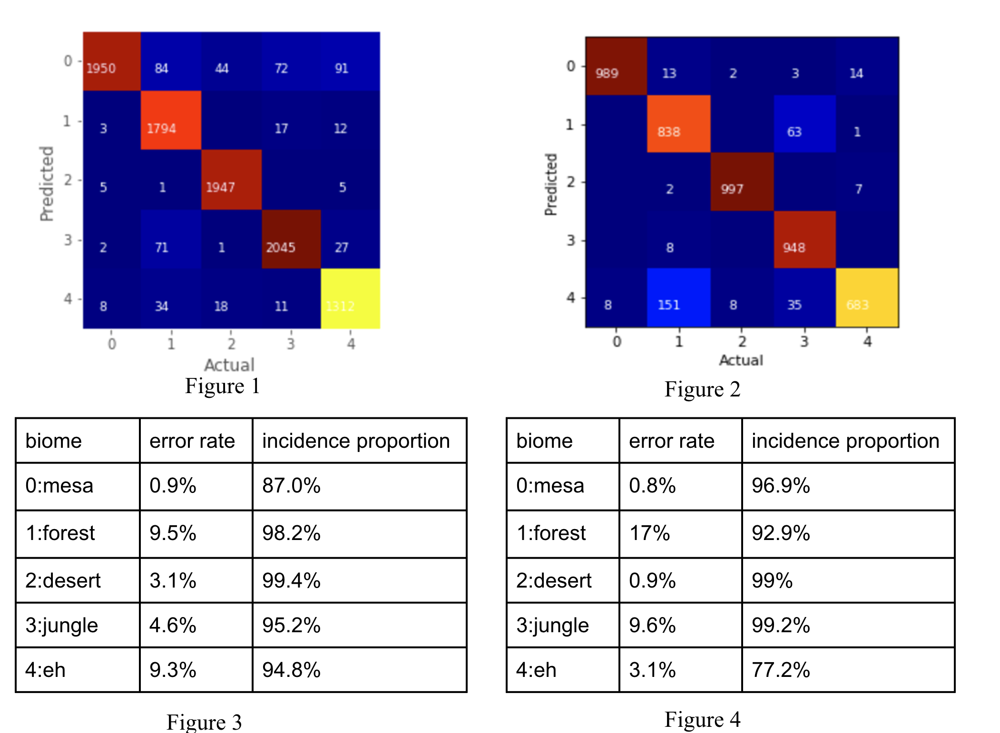
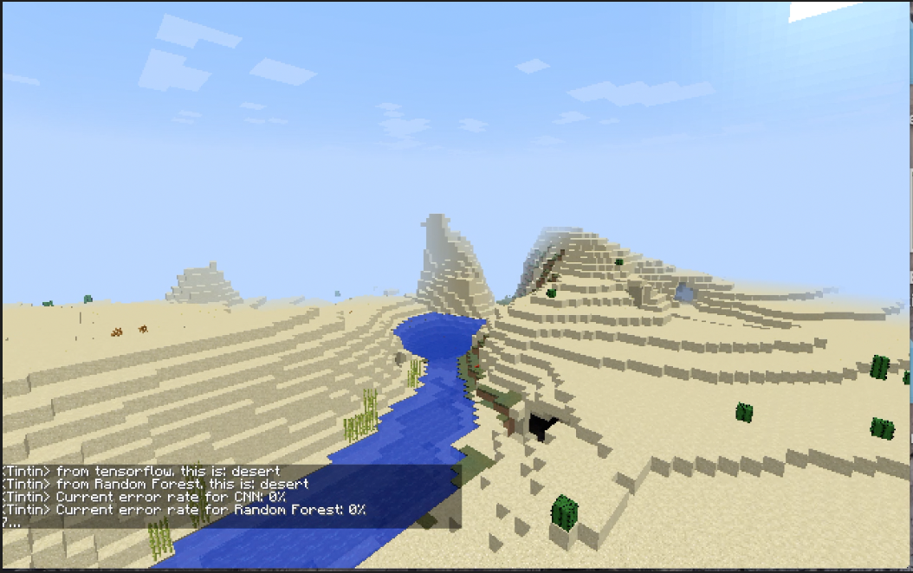
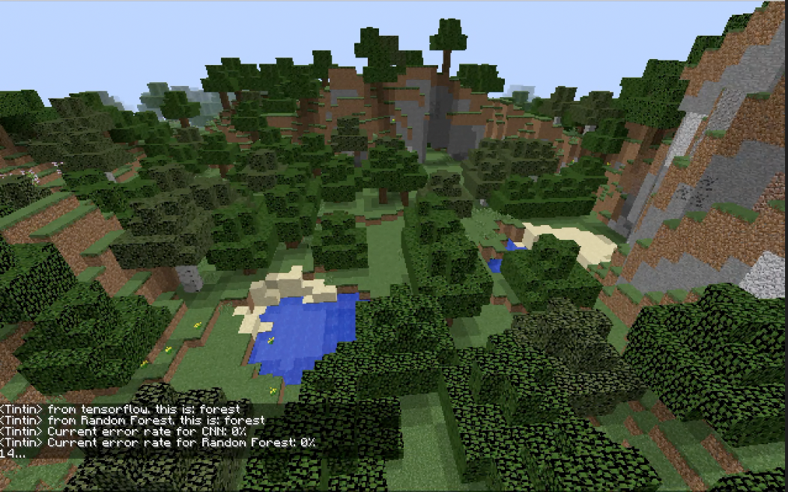
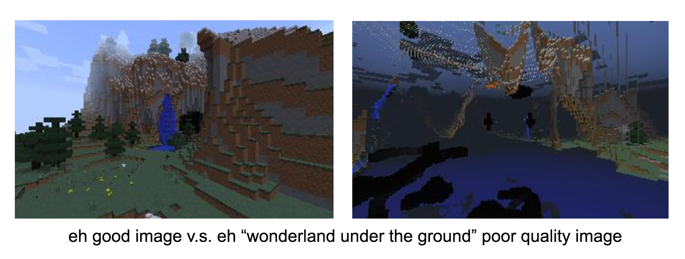

<iframe width="854" height="480" src="https://www.youtube.com/embed/QIMOxfvPPdk" frameborder="0" allowfullscreen></iframe>

## Project summary

​ Our Minecraft-AI project basically focuses on image classifications in Minecraft. Eventually, our agent "Tintin" can give predictions on the biome, current weather and the pig occurance continuously based on the images he perceives.

### Goal changes

Instead of just constructing models for biome recognition and giving a simple error rate for each model as the result, we combine our CNN/Random forest models with Malmo. Therefore, we are able to let agent give a prediction continuously while a player is controlling it in a Minecraft world. Meanwhile, we also add weather and pig recognition as a goal. 

### Data collection changes

In the proposal, we were supposed to collect at least 500 samples as the training data, but we soon find it insufficient and collect about 50,000 samples eventually. Rather than collecting data in a fixed environment, we generate worlds with different weathers at different time for each biome, which is more complicated than expected. besides, we do not collect the information about temperature. 

## Approach

### Data Collection

Since we have three different classifications, we need to collect three types of the data. For biome classification, we have collected 47,770 images in total for 5 different biomes. Specifically, we generate a single biome world for each biome type with different weathers and run multiple Malmo sessions in this world to collect data. In this way, we can know the ground truth of each image directly. For weathers classification, we have gathered 1,000 images under five different biomes for each of the four kinds of weather ("rain", "thunder", "clear" and "normal"), that is, 5000 images in total. We think that weather is more structured to recognize biomes, so we decided to collect fewer data. For the pig classification, we only collect 100 images of a pig in a fence since the data of pig is much more structured with many pink blocks.

In each Malmo session, the agent starts with a random position in the world, and then walk a random distance and rotate an arbitrary angle. We record the whole mission using the recordMP4 function, then get frames from the video every 0.5 seconds and save the array of pixels into images using PIL module. Therefore, for each biome, we collect 10000 screenshots that have different time (morning, noon and night). The image size is 320x200x3 (Width x height x channels) , which is smaller than the default Minecraft size (640x400x3) to save some storage space. After data collection, we delete some poor quality images manually. 

The table blow illustrates the actual size of data we collected. 

There may be some errors in our data because our agent sometimes walks into the ground, or inside mountains. Sometimes, the agent collects images that are mostly sky. We tried to delete as much bad data as possible manually. This is the reason why we have comparatively small size of data for the eh biome. 

### Data Preprocessing

​After we collect the data, we deal with the images in two different ways, one for the Convolutional Neural Network (CNN), and the other for the traditional Machine Learning (ML) methods. Given the large size of our image data, we found it impractical to load all images to the memory at one time for training and testing. 

​For the CNN, since we want to keep the original images and use a small batch of data to train the model. We convert our dataset to two [tfrecord](http://warmspringwinds.github.io/tensorflow/tf-slim/2016/12/21/tfrecords-guide/)  files (training/testing). We also use a FIFO queue with 3 threads to read the tfrecord and get a random batch every time we call it. In contrast to what we do for CNN, we convert an 320x200x3 image to data with 24 features for the traditional ML methods. Because of the difference in colors, human can recognize if an image is showing a mesa biome or a forest biome at a glance. That gives us an inspiration: is it possible to classify a biome simply based on the colors? For each image in the dataset, we extract colors using OpenCV module. An image is represented as an np array with shape (320,200,3) in python.There are three channels, R,G,B, for an image, and in each channel there are 320x200 cells. Value in each cell vary between 0 and 255, inclusive. We get a histogram with 8 bins for each channel, that is, we divide range 0-255 into 8 small ranges. For each bin (e.g. range 0-32), we count the number of cells with value in that range. The histogram shown below represent the result for the mesa image at the left. 

​For traditional Machine Learning (ML) methods, we load data into txt file and then use scikit-learn random forest multi-class classifier model. After we get 8 bin values for each channel, and 24 bin values in total as an 8x3 array above, we flatten it to be an 1-d array and write it as a row to a txt file with a corresponding label. Since the size of data is significantly reduced, we can now load all the training data and test data for the training using scikit-learn. 

### Traditional ML

​We know that some biomes (datasets) are pretty structured, so we decide to try Traditional Machine learning methods to see if they have better performance in these biomes. Specifically, since the colors (RGB) of desert and mesa are very distinguishable, the dataset for this biome is pretty structured and we want to try Support Vector Machine (SVM) and random forest to deal with it. For instance,  in Figure 5 (Desert), 6 (Forest), 7 (Mesa), the construction of each Figure is very different and distinguishable.

​Since we have three classes, R, G and B, We have tried MultiOutputClassifier with SVM and random forest. SVM is defined by a convex optimisation problem (no local minima) for which there are efficient methods and helps avoid over-fitting. However, SVM was very inefficient to train especially with large dataset. So we prefer to use random forest. Random forest, since it is nothing more than a bunch of Decision Trees combined, can handle categorical (binary) features very well. The other main advantage is that, because of how it is constructed (used bagging) these algorithms handle very well high dimensional spaces as well as large number of training examples. The Random Forest Multi-class Classifier we use have 100 estimators and a ramdom state of 1. 

​We train our model based on the preprocessed data with 24 features about RGB information for a single image. At the end, we test the performance of our training result using the test data in the separated test txt. 

### CNN

Some traditional machine learning methods, such as Support Vector Machine (SVM), have bad performance when the dataset has a lot of features. For an image, we can view each pixel as a feature, so an image with size 320x200x3 will have 192,000 features, which is unmanageable by the SVM. By the way, we make those methods workable for our large size data is to extract RGB histograms from each images as features. However, it does not maintain the basic structure of an image and loses too much information (e.g. shape) of it. On the contrary, [Convolutional Neural Networks](http://cs231n.github.io/convolutional-networks/#conv) take advantage of the fact that the the input consists of images and they constrain the architecture in a more sensible way. For example, the CONV layer in CNN extract image features with convolution operation.

We implement a CNN model based on the instructions from [https://www.tensorflow.org/get_started/mnist/mechanics](https://www.tensorflow.org/get_started/mnist/mechanics) and [https://www.tensorflow.org/get_started/mnist/beginners]( https://www.tensorflow.org/get_started/mnist/beginners). We use the data in tfrecord files. We separate the training data and the test data with a ratio of 9:1. Note that for all the data we feed into the CNN, values in each image are rescaled from [0, 255] down to [-0.5, 0.5] and data type is casted to float32. This is necessary because we feed the data into the training/prediction nodes(represented as tf variables) only accept data in some some specific types. We construct our CNN model which consists of 2 conv2d, 2 relu, 2 max pooling, 1 hidden, and 1 dropout layers.  The figure below presents the basic  model structure.

After we train our model, we test the performance of our training result using the test data in the separated test tfrecord file. 

​	

## Evaluation

Our evaluation plan has two parts. One is the quantity evaluation and the other is the quality evaluation. In the quantity evaluation, we use the sparated test data that is also collected by the agent earlier in the Minecraft world, and give the error rate and the incidence proportion after we train our model. In the quality evaluation part, we combine our models with Malmo in Minecraft. We control our agent to walk in a Minecraft world with a single biome, and test the actual error rate based on the images the agent perceived in the Malmo mission.

### Quantitative part

For the quantity evaluation, we use separated training data and test data to train the model and to assess the correctness. we have calculated the error rate and the incidence proportion for both CNN and random forest model with following two formulas. 

 $$ \textrm{Error rate of }i = \frac{\textrm{number of (Predicted label } i \textrm{ AND Actual label i)}}{\textrm{number of Actual label i}} $$ 

$$ \textrm{Incidence proportion of }i = \frac{\textrm{number of (Predicted label } i \textrm{ AND Actual label } i)}{\textrm{number of Predicted label } i} $$

Note that for the CNN model, we separate our dataset to training data and test data with a ratio of 9:1 but in the random forest classifier, we separate it to be 8:2. The result may be affected. 

Figure 1 and 3 has shown the performance of Random Forest multi-class classifier. We train our model with our large dataset which transformed 50,000 images for 5 different biomes to txt file. At the end, we test the performance of our training result using the test data in the separated test txt. The overall test error rate is 5.29%. In figure 3 we calculated the error rate and the incidence proportion.We get the best prediction result for the mesa biome with class label 0, because it predicts 1950 test images correctly and the error rate is 0.9%.But we get pretty bad error rate 9.3% for the eh (extreme hill) biome with label 4 and error rate 9.5% the forest biome with label 1. 

​Figure 2 and 4 has shown the performance of CNN. We train our model with our large dataset which contains 50,000 images for 5 different biomes. At the end, we test the performance of our training result using the test data in the separated test tfrecord file. The overall test error rate is 4.7%. The figure below illustrates the performance of the result on different biome classes. We get the best prediction result for the desert biome with class label 0, because it predicts 989 test images correctly and the error rate is 0.8%. But we get the worst error rate 17% for the forest biome with label 1.  

### Quality part

​To evaluate the quality of our project, we combine our two models: CNN and Random Forest with malmo.  Our player control agent "TinTin" to walk in the Minecraft world and "Tintin" can give a prediction of the biome continuously. We calculate the error rate every time after "Tintin" makes a prediction. In Figure 8, you can see the prediction of CNN and Random Forest at this moment is both dessert and the current accumulated error is  0% for both. In Figure 9, you can see the prediction of CNN and Random Forest at this moment is both forest and the current accumulated error is 0% for both.

## Remaining goals and challenges  

### Remaining goals

​As is stated in the project summary, we have three goals for our project: biome recognition, weather recognition and pig recognizaiton.Up to now, we almost finish the primary goal, namely, biome recognition. For weather recognizaiton and pig recognizaiton, we have already collect the data. For the reamaining of the quarter, we will mainly focus on finishing weather recognizaiton and pig recognition. If time permits, we would better improve the performance of biome recognition. Eventually, the player will control  “TinTin”(the agent) give a prediction of the biome, current weather and pig occurance continuously while in a Minecraft world and see the correctness.  

### Challenges

​We have faced few challenges during the process of achieving our goals. Even though we have overcame many challenges like constructing CNN or creating a virtualenv and install tf to integrate our models with malmo,we still mainly have two challenges. First of all, one big remaining challenge is to improve the quality of our image. There are some poor quality image for eh biome like below, which have negative effect on our model classifications. Secondly, we need to find a way to combine CNN and Random Forest model and improve the performance.

